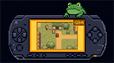

# ToadGBA — TempGBA/FrogGBA mod by AlfonsoVM

> **ToadGBA** is a fork of [FrogGBA](https://github.com/tzubertowski/FrogGBA) for PSP,
> focused on visual quality, GPU-accelerated filters, and correctness fixes.

## Download & Installation


**→ [Download the latest release here](https://github.com/AlfonsoVM/ToadGBA/releases) ←**

You need custom firmware (CFW) on your PSP.

1. Unzip the downloaded file.
2. Copy the `PSP` folder to the root of your PSP memory card.
3. Launch *ToadGBA* from the XMB game menu.

---

## What's New (v1.0)

### For Players

- **Sharp Bilinear filter** — combines a GPU 2× pixel-doubling pass with bilinear
  scaling to the display. Games look crisp at any aspect ratio, with no CPU cost.
- **LCD grid filter** — optional pixel-grid overlay that simulates the GBA screen
  (Off / Subtle horizontal lines / Full GBA grid). Rendered entirely on GPU.
- **Color correction modes** — GPSP, Retro, AGS-101, LCD Dim, and Off.
  Optimized with per-channel lookup tables; negligible performance impact.
- **Brightness, contrast, saturation, color temperature, RGB controls** — full
  image tuning from the in-game menu.
- **4:3 pillarbox, Zoom, and Stretch aspect ratios** — in addition to the native
  3:2 GBA ratio.
- **Custom overlay/bezel system** — load PNG borders as `.ovl` files.
  Full-screen support, X/Y offset, RLE compression for complex designs.
- **Recent Games list** — last 10 played titles shown at the top of the file browser.
- **SMART frameskip mode** — predictive frameskip with a debt accumulator that
  eliminates the 30 FPS oscillation caused by the old reactive-only AUTO mode.
- **Fast-forward** — SELECT + R toggles 2×/3× speed.
- **Show current directory** in the Directories menu.
- **Numerous crash and stability fixes** — startup crash without a game loaded,
  language-switch crashes, file-browser crashes, save/load state guards, and more.

### Performance Highlights

- **GPU Sharp Bilinear** frees the CPU from the old `apply_pixel_double()` memcpy
  loop (~384 KB of CPU-driven VRAM bandwidth per frame). The GE does the same work
  in a fraction of the time.
- **Targeted dcache flushes** — replaced the blanket `DcacheWritebackAll()` calls
  with `sceKernelDcacheWritebackRange()` scoped to the exact texture region.
- **GBC stereo panning fix** and **timer prescale fix** improve audio accuracy and
  stability in games that use timers 2–3.
- **Removed `PSP_REDUCE_CACHE_INVALIDATION`** — the JIT stale-code bug it masked
  caused random glitches; removing it improved correctness without a speed cost.
- **64 MB RAM mode** on PSP Slim (PSP-2000/3000/Go) for extra JIT cache headroom.

---

## Acknowledgements

ToadGBA builds on the work of many people across the GBA emulation community:

- **[gpSP](https://github.com/HACKERCHANNEL/gpsp)** by *Exophase* — the original
  GBA emulator for PSP that started it all.
- **[gpSP Kai](https://github.com/uofw/gpsp)** by *takka* — the definitive PSP
  performance and compatibility fork that proved what the hardware could do.
- **[TempGBA](https://github.com/Nebuleon/TempGBA)** by *Nebuleon*, *Normmatt*,
  and *BassAceGold* — the base layer ToadGBA ultimately rests on.
- **TempGBA4PSP-mod** (TempGBA4PSP-26731020) — additional patches incorporated
  into TempGBA.
- **[FrogGBA](https://github.com/tzubertowski/FrogGBA)** by *tzubertowski* — the
  direct parent of ToadGBA; added AGS-101/LCD-Dim color modes, brightness control,
  and 4:3 pillarbox before this fork diverged.

---

## Original TempGBA Features

- gpSP Kai cheats support
- Chinese language support
- Restore function
- New menu icon
- TempGBA-mod-dstwo patches
- Modern PSP SDK / Docker build system

---

## Building from Source

Requires Docker:

```bash
docker-compose run --rm psp-dev
```

Output files appear in `build/`. Copy `EBOOT.PBP` to `/PSP/GAME/ToadGBA/` on your
memory card.

---

## Custom Overlays

1. Visit **[toadgba.onrender.com](https://toadgba.onrender.com)** and upload a
   480×272 PNG (transparent center = game area, opaque edges = bezel).
2. Download the generated `.ovl` file.
3. Copy it to `/PSP/GAME/ToadGBA/overlays/` on your memory card.
4. In-game: **HOME → Overlay Settings** → select and enable.

---

## Technical Notes for Developers

This section documents every significant change made to the codebase since the
FrogGBA fork, with enough context to understand the "why" behind each decision.

### Sharp Bilinear Filter (GPU, two-pass)

**Goal:** replace the CPU `apply_pixel_double()` loop with a GPU equivalent.

The old path wrote ~384 KB of data to VRAM per frame: for each of 160 GBA rows
it read the source scanline, built a u32-packed doubled row in a stack buffer,
and did two `memcpy` calls into `scale2x_buffer`. At PSP memory bandwidth this
cost ~0.5–2 ms per frame and was perceptible on slower titles.

**New pipeline:**

```
screen_texture (240×160, VRAM)
  → Pass 1: GE nearest-neighbor upscale → scale2x_buffer (480×320, VRAM)
  → Pass 2: GE bilinear render          → framebuffer (display rect)
```

Both passes are separate `GU_DIRECT` submissions separated by `sceGuSync()`.
The sync is mandatory: a single display list with `sceGuTexFlush()` between
the two draws is insufficient on PSP — the GE rasterizer and texture unit can
pipeline such that Pass 2 reads `scale2x_buffer` before Pass 1 finishes
writing it.

**VRAM layout:**

```
VRAM 0x4000000
  + 0x00000  FB0  (512×272×2 = 0x44000)
  + 0x44000  FB1  (0x44000)
  + 0x88000  screen_texture  (256×256×2 = 0x20000)
  + 0xA8000  scale2x_buffer  (512×320×2 = 0x50000)
```

`scale2x_buffer` is declared with stride 512 so the GE can treat it as a
512×512 power-of-two texture in Pass 2. `sceGuTexImage(0, 512, 512, 512, ...)`.

**Why `GU_DIRECT`, not `GU_CALL`, for Pass 1:**

An earlier version pre-built Pass 1 as a static `GU_CALL` list
(`display_list_gpu_scale`) built once at init. This caused a persistent
double-image/flicker artifact. The root cause: `sceGuDrawBuffer()` inside a
`GU_CALL` sub-list is non-standard on PSP. All PSP render-to-texture examples
in the wild use a dedicated `GU_DIRECT` submission for the write-to-offscreen
pass, not a `GU_CALL`. Moving Pass 1 inline into `bitbilt_gu()` as a
`GU_DIRECT` list fixed the artifact completely.

Pass 1 rebuilds 8 vertex structs (80 bytes) each frame via `sceGuGetMemory`
— negligible cost compared to the eliminated CPU memcpy.

**Screen-texture dcache flush:**

Before Pass 1 the code calls:
```c
sceKernelDcacheWritebackRange(screen_texture,
    GBA_SCREEN_HEIGHT * GBA_LINE_SIZE * sizeof(u16));
```
This emits a MIPS SYNC that drains the GBA renderer's CPU write buffer before
the GE DMA reads `screen_texture`. Without it the GE can race the CPU and read
a partially-written frame.

---

### LCD Grid Filter (GPU screen-space)

The grid filter draws darkened horizontal (and optionally vertical) strips over
the framebuffer in PSP screen space, simulating a GBA LCD pixel grid.

**Implementation:**

- Pre-built `GU_CALL` list (`display_list_grid`) containing a strip of thin
  `GU_SPRITES` quads covering the display rectangle.
- Rendered with `GU_BLEND` multiply mode so it darkens what's already in the
  framebuffer without a separate readback.
- Grid vertices are cached and only rebuilt on display-mode change, so there is
  zero per-frame CPU cost beyond the GE submission itself.
- The old implementation ran as a CPU per-pixel loop over VRAM — replaced
  entirely with the GPU path.

---

### Color Correction (LUT-based hot path)

Color correction converts RGB555 pixels from `screen_texture` to the target
color profile. Three-tier approach:

1. **u32-pair inner loop** — processes two adjacent pixels per iteration using
   a single 32-bit read/write, halving memory bandwidth.
2. **Per-channel LUTs** — 32-entry lookup tables (one per RGB channel) pre-built
   at mode-change time. The LUTs encode brightness, contrast, saturation,
   color temperature, and per-channel gain in a single indexed lookup, collapsing
   what would be 6–8 arithmetic ops per pixel into 3 table lookups.
3. **Prefetch** — `__builtin_prefetch` on the next pixel pair keeps the LUT hot
   in L1 cache.

The combined LUT is rebuilt by `rebuild_color_lut()` whenever any color option
changes; per-frame cost is zero.

---

### Targeted dcache Flushes

Replaced `sceKernelDcacheWritebackAll()` (full dcache flush) with
`sceKernelDcacheWritebackRange(ptr, size)` scoped to exactly the texture region
the GE needs. On PSP the dcache is 16 KB; a full flush evicts working data
from the JIT and audio paths, adding measurable overhead every frame.

---

### PSP_REDUCE_CACHE_INVALIDATION Removed

This compile flag reduced JIT cache invalidation aggressiveness, which hid a
bug where stale translated code could be executed after ROM data changed.
Removing it restored correct invalidation behavior. The performance regression
was negligible in practice — the flag was only valuable when paired with a
larger JIT cache, which TempGBA's allocation did not provide.

---

### JIT Cache Pre-Warm Removed

At startup ToadGBA used to call a function that touched every JIT cache entry
to "pre-warm" TLB entries. On PSP the JIT cache resides in uncached VRAM, so
TLB warming has no effect — the reads were pure wasted bus bandwidth.

---

### Timer Prescale Fix (Timers 2–3)

`timer_control_low()` read `timer_prescale[timer_number]` before the write that
updated it, then stored the old value back. For timers 2 and 3 this corrupted
the prescale setting on every write, causing audio drift in games that use
cascaded timers for sample-rate generation. Fixed by storing the prescale only
after reading the new value from the register.

---

### GBC Stereo Panning Fix

`RENDER_SAMPLE_BOTH` in `sound.c` was applying left and right panning to the
wrong channels (left gain on right output and vice versa). Fixed by matching the
channel index to the correct output side.

---

### Sound Thread Wakeup Delay Removed

`fill_sound_buffer()` waited 100 µs after waking the audio thread before
returning. This delay was a defensive workaround for a race that no longer
exists after the buffer management was rewritten. Removing it reduces audio
latency by one scheduler tick per buffer cycle.

---

### `fill_sound_buffer()` Linear-Segment Rewrite

The old implementation iterated the ring buffer one sample at a time, calling
`memcpy` in a per-sample loop. Replaced with a two-segment approach that
computes the contiguous regions of the ring buffer and issues at most two
`memcpy` calls per fill. Reduces function-call overhead significantly for large
buffers.

---

### `obj_priority_list` Cache-Locality Fix

OBJ scanline data was stored as `[priority][scanline]`. The hot rendering loop
iterates by scanline first, so access was striding across 160 rows × 4 bytes
for each priority level — cache-unfriendly. Transposed to `[scanline][priority]`
so the inner loop is sequential.

---

### Redundant IO Register Read Elimination

Several per-scanline rendering functions read the same IO registers multiple
times per call (BG scroll, affine parameters, etc.). Hoisted reads to
locals at the top of each function. Reduces register pressure and eliminates
repeated uncached VRAM reads in the hottest path of the emulator.

---

### VRAM Write Optimization (u32-pair + memcpy)

Inner loops that wrote pixels to VRAM one `u16` at a time were replaced with
`u32`-pair writes (two pixels per store) where alignment permits, and with
`memcpy` for full scanline copies. On PSP the VRAM write bus is 32-bit wide;
pairing writes doubles effective throughput.

---

### SMART Frameskip

The original AUTO frameskip mode was purely reactive: it compared the previous
frame's real time against the VBlank period and skipped the next frame if behind.
This produced a visible 30 FPS oscillation (skip → catch up → skip → ...).

SMART mode adds a **debt accumulator**: excess time beyond the threshold
accumulates and is paid off gradually over multiple frames rather than triggering
a skip on every late frame. The result is smoother pacing at the same average
frame rate.

---

### `affine_render_scale_pixel` Tile-Pointer Cache Fix

This function cached `tile_ptr` across calls to avoid re-computing the tile
address on consecutive pixels of the same tile. A logic error caused the cached
value to be overwritten with `NULL` at the end of the first cached iteration,
nullifying the optimization on the very next call. Fixed by preserving the
pointer until the tile index actually changes.

---

### `psp_fclose` Handle Nulling

`psp_fclose()` closed the file but did not set `*filename_tag = -1` afterward.
Any code that checked the handle after close would see a stale valid-looking
value and attempt a double-close or use-after-close. Fixed by zeroing the
caller's handle unconditionally after `sceIoClose`.

---

### Dead Code Removal

- **`cpu_common.c`** — duplicate of definitions already in `cpu.c`; removed.
- **Layer-merge system** — an incomplete multi-layer merge optimization that
  measured slower than the baseline renderer in all tested configurations; removed.
- **`-funsafe-loop-optimizations`** — a GCC flag that can silently mis-compile
  loops with pointer aliasing; removed from `CFLAGS`.
- **Scale2x filter** — the software Scale2x upscaler was retained briefly but
  removed because it was CPU-heavy and visually inferior to Sharp Bilinear on
  the PSP screen. Sharp Bilinear covers the same use case on GPU.
- **Sharpness filter** — a per-pixel CPU sharpening pass; removed because the
  per-pixel VRAM read pattern was too expensive on PSP.
